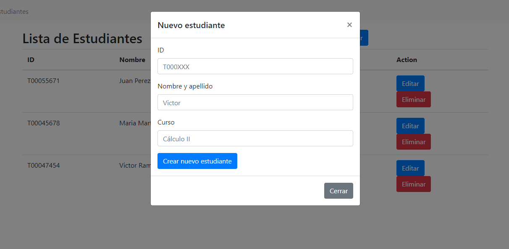

# client-consumer

Pasos para levantar el servidor (POWERSHELL)

```shell
$ py -3 -m venv my-venv
```

```shell
$ my-venv\Scripts\activate  
```

```shell
$ pip install flask
```

```shell
$ $env:FLASK_APP = "app"
```

```shell
$ $env:FLASK_ENV = "develop"
```

```shell
$ flask run
```

Ir a http://127.0.0.1:5000/

## Previews


